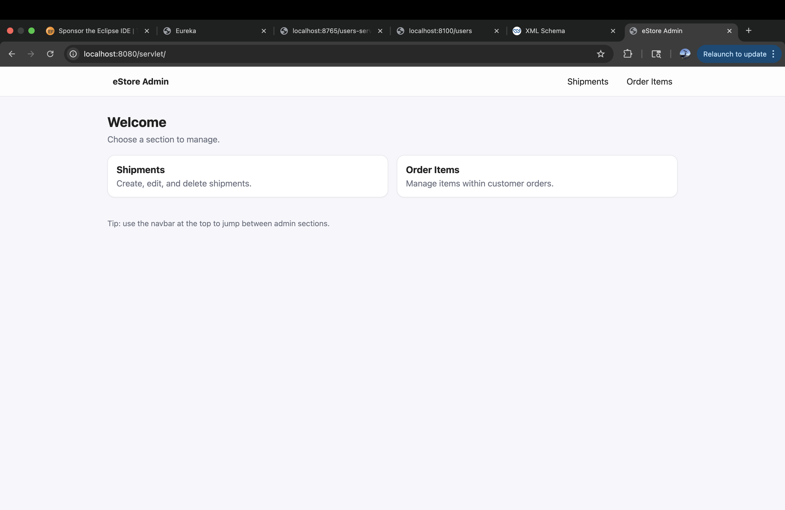
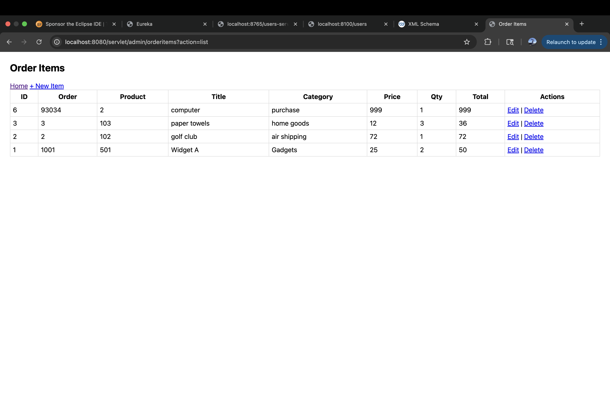
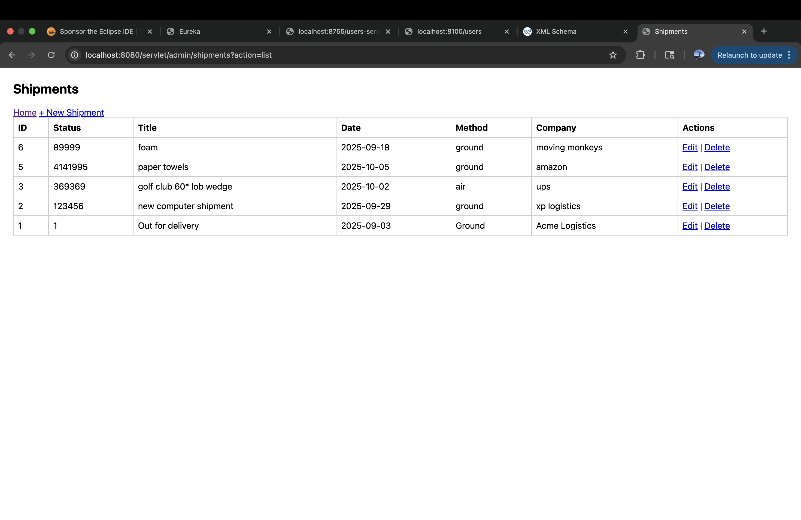

# eStore Web Application

Full-stack web application built using Java, Servlets, JSP, and MySQL.  
This project simulates an e-commerce admin system for managing clients, meetings, and related data.

## Features
- CRUD operations for managing data (clients, meetings, etc.)
- Dynamic web pages using JSP
- MVC architecture (Servlets as controllers)
- Database integration with MySQL
- Server-side request handling and routing

## Tech Stack
- Java
- Servlets & JSP
- MySQL
- JDBC
- Apache Tomcat
- Maven

## What I Learned
- How to build dynamic web applications using Java Servlets and JSP
- Handling HTTP requests and responses
- Structuring applications using MVC design pattern
- Connecting backend applications to a relational database
- Writing SQL queries and integrating them into Java code

## How to Run
1. Clone the repository
2. Import the project into Eclipse
3. Run on Apache Tomcat
4. Access the application using the configured Tomcat context path (for my local setup):
   http://localhost:8080/servlet/

  ## 📸 Application Preview

  <b>Dashboard</b> 
  

  <b>Order Items</b> 
  

  <b>Shipments</b> 
  

